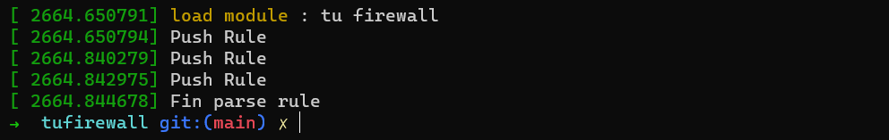
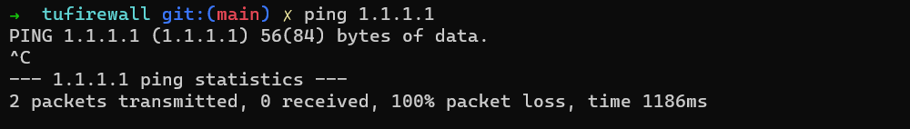
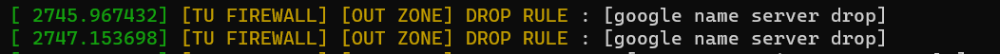
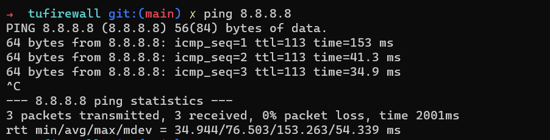
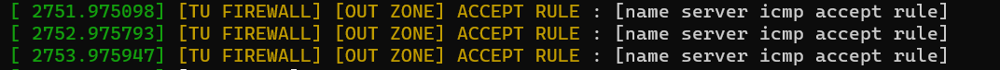
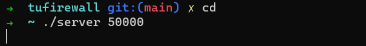
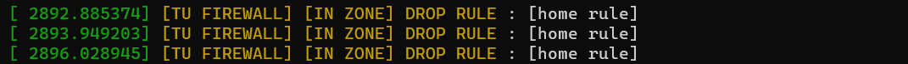
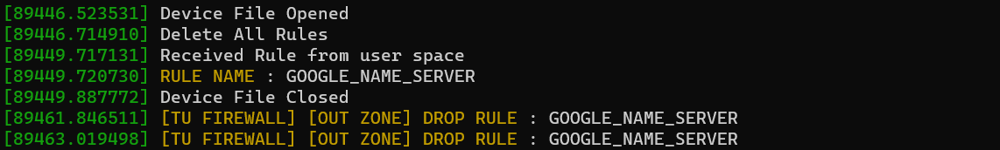

# tufirewall
kernel 5.15 version tu firewall using netfilter hook  
사용자가 설정의한 룰 설정 파일을 기반으로 리눅스 방화벽을 구성해주는 모듈입니다. 

# Logic
linux에서 사용되는 방화벽 iptables는 netfilter hook의 알람을 받아 패킷의 처리를 진행한다.  
이처럼 tufirewall 또한 kernel module로서 동작하며 netfilter hook(NF_INET_LOCAL_IN, NF_INET_LOCAL_OUT)의 알람을 받아 패킷의 처리를 진행한다.

NF_INET_LOCAL_IN : 패킷이 호스트내부로 전송   
NF_INET_LOCAL_OUT : 호스트에서 외부로 패킷이 전송 

패킷의 기본적인 필터는 아래의 구조체를 기반으로 진행한다. 
```C
struct rule_data
{
	char name[MAXINUM_RULE_NAME];
	__u8 action; //NF_ACCEPT, NF_DROP
	__u8 protocol; 
	__u8 when;   //determin NF_INET_LOCAL_IN, NF_INET_LOCAL_OUT

	__u32 ip;
	__u16 port;
};
```
- name : 해당 rule의 이름  
- action : 해당 rule에 대해서 DROP할지 ACCEPT할지 결정  
- when : 해당 rule에 대해서 패킷이 LOCAL_IN인지 LOCAL_OUT인지 결정  
- ip : 필터링하려는 IP, when에 따라서 source ip일지 dest ip일지 결정  
- port : 필터링하려는 PORT, when에 따라서 호스트의 dport일지 외부주소의 dport일지 결정  


### 코드흐름으로는 아래와 같다.  
1. NF_INET_LOCAL_IN or NF_INET_LOCAL_OUT 이벤트 발생 
2. hooknum에 따른 핸들러 호출(packet_in_zone_handler, packet_out_zone_handler)
3. list_for_each 매크로를 이용하여 사용자가 지정한 rule을 반복문 돌리면서 해당 패킷에 대해서 필터링 진행 
4. rule_match 함수를 통해 사용자의 rule과 패킷에 대해서 일치하는지 진행  
일치한다면 TU_RULE_MATCH, 불일치 한다면 TU_RULE_NONE_MATCH 반환 
5. TU_RULE_MATCH에 대해 지정한 ACTION 수행  

### Userspace 통신과정 추가 (2023-06-01)
1. 사용자가 정의한 Rule 파일 (tu.conf)을 기반으로 룰 정보를 파싱한다.   
2. Kernel Module은 Device를 생성하여 /dev 폴더에 위치   
3. 어플리케이션 프로그램은 tu.conf 파일을 기반으로 파싱된 룰을 IOCTL을 이용하여 Kernel Module로 데이터 전송   
4. 이때 전송단계는 모든 룰을 지우는 명령과, 룰 하나씩 전송 순으로이다.  


사용가능한 필터는 ICMP, TCP, UDP이며 현재 버전은 테스트 케이스 생성뿐이다.  
추후 웹페이지를 만들어 설정파일 생성 및 로드 예정

# Usage
커널 크래시 발생할 수 있으니 테스트시 사용하지 않는 서버 또는 일회성 서버에서 테스트 바랍니다.
```Shell
git clone https://github.com/txuna/tufirewall.git 
cd tufirewall 
sudo make 
sudo insmod firewall.ko 
```

# Update Rule
IOCTL을 사용하여 현재 커널 모듈에 등록된 룰을 지우고 새로운 룰을 등록합니다. 
```Shell
cd ./service
vi tu.conf # 룰 정보 수정하면 됩니다. 
gcc load_tufirewall.c -o load 
sudo ./load # IOCTL을 사용하는 것이기에 관리자 권한이 필요합니다. 
```

### Tu.Conf
```Shell
# custom config file

[rule]
WHEN = OUTPUT
ACTION = DROP
IP = 8.8.8.8
PROTOCOL = ICMP
NAME = GOOGLE_NAME_SERVER
[end]

[rule]
WHEN = OUTPUT
ACTION = DROP
IP = 1.1.1.1
PROTOCOL = ICMP
NAME = GOOGLE_NAME_SERVER
[end]

[rule]
WHEN = IN
ACTION = DROP
IP = 200.200.200.200
PROTOCOL = TCP
NAME = TEST_RULE
PORT = 50000
[end]
```

# Log 
```Shell
sudo dmesg
```

# Delete
```Shell
sudo lsmod | grep firewall
sudo rmmod firewall
```

# Images
### RUN firewall module 


### DROP ICMP 


### DROP ICMP REASON


### ACCEPT ICMP


### ACCEPT ICMP REASON 


### DROP TCP 


### DROP TCP REASON


### RULE ADD Message


